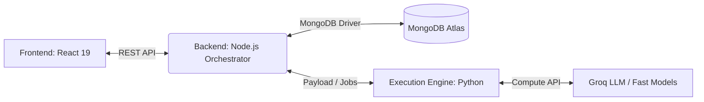
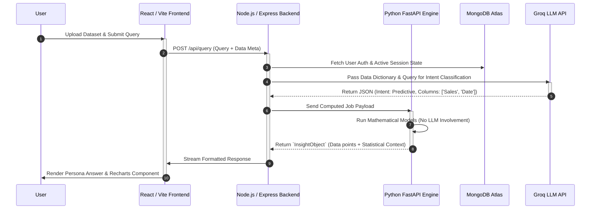

<div align="center">
  

  # Bolt - Speed & Impact

  **Your AI-powered data analyst. Talk to your data in plain language, eliminate AI hallucinations, and get instant, rigorous, persona-aware insights.**

  <br />
  <a href="https://bolt-kzf5.onrender.com/">
    
  </a>
  <br />

  [](https://opensource.org/licenses/MIT)
  [](https://reactjs.org/)
  [](https://nodejs.org/)
  [](https://www.python.org/)
  [](https://vitejs.dev/)
</div>

Readme updated sections · MD
Copy

---
 
## Overview
 
**Enterprise LLMs are great at poetry. They are terrible at math.**
 
Bolt is a **deterministic data engine disguised as a conversational interface** — built for the NatWest Hackathon 2026 by **Algo-Vengers**. It solves the single most dangerous flaw in AI-powered analytics: the hallucinated number that sounds completely confident and is completely wrong.
 
The architecture is deceptively simple in principle, and genuinely hard to replicate in practice:
 
- **The LLM acts as a strict compiler.** It reads your plain-language question and produces a structured execution plan. Nothing more.
- **Python handles all the math.** Aggregations, z-scores, forecasts, and comparisons are computed deterministically — never invented.
- **React delivers the insight.** The same verified result is rendered as a persona-aware, accessible, multilingual response tailored to who is actually reading it.
 
The result is a platform that gives you the conversational fluency of a modern AI assistant with the numerical integrity of a regulated data pipeline. No hallucinations. No guessing. Just clarity, absolute trust, and lightning speed.
 
---
 
## The Problem and Our Solution
 
### The Problem: You Cannot Trust an LLM with a Spreadsheet
 
In enterprise banking and finance, data questions have consequences. A wrong number in a portfolio forecast is not an interesting error — it is an audit failure, a compliance breach, or a bad decision made in a boardroom.
 
The market currently offers two inadequate options:
 
**Option 1: Generic AI chat over your data.**  
Models like ChatGPT Advanced Data Analysis or Claude process your question and attempt to calculate the answer conceptually. They often get it wrong silently. Worse, they require uploading raw financial datasets to external APIs — a compliance nightmare for any regulated institution. And they give the same verbose, one-size-fits-all response to a first-year analyst and a Chief Risk Officer alike.
 
**Option 2: Traditional BI dashboards.**  
Power BI, Tableau — accurate, but rigid. They require technical configuration, offer no conversational interface, and cannot adapt their outputs to the person asking. Time-to-insight is measured in hours, not seconds.
 
### Our Solution: Deterministic Decoupled Architecture
 
Bolt introduces a fundamentally different trust model.
 
The LLM never touches the math. Ever.
 
When a user submits a question, Groq generates a strict **JSON execution plan** — a compiler output, not an answer. That plan is forwarded to an isolated Python engine running on Pandas and NumPy. The engine executes the computation, returns a verified result contract, and only then does any language model re-enter the picture — purely to translate hard numbers into human-readable narrative.
 
This is the difference between an AI that *performs* confidence and a platform that *earns* it.
 
**What this means in practice:**
 
- Raw data never leaves the secure execution environment. Only column names and aggregated results are ever exposed to the LLM layer — a fundamental data privacy guarantee that generic AI tools cannot match.
- Every calculation is deterministic by default. Run the same query twice and you get the same answer, with a traceable audit trail.
- The system adapts its output to the person reading it — a beginner gets a plain-English summary, an auditor gets exact values, filters, formulas, timestamps, and source references.
- Switching personas costs zero tokens and zero recomputation. The verified result is stored client-side and re-rendered locally.
 
---
 
## Why Bolt Matters
 
Most AI analytics tools are built around a dangerous assumption: that making an LLM *sound* rigorous is equivalent to making it *be* rigorous.
 
Bolt rejects that assumption entirely.
 
### Trust Over Theatrics
 
The architecture is designed around a single question: *what does a financial institution actually need to trust an answer?*
 
- **Traceable computation.** Every result comes with the formula, the filters, the raw values, and the method used to produce it. An auditor can inspect any response and understand exactly how the number was derived.
- **Read-only by design.** The execution engine architecture explicitly blocks state-changing operations at the infrastructure level. No LLM prompt injection can trigger a destructive database command — because the engine only accepts read operations.
- **Privacy by construction.** The data pipeline is isolated. Your 500,000-row transaction ledger never enters a third-party LLM context window. Only the schema and query metadata do.
 
### Inclusive by Default
 
Bolt was built for everyone in the organisation, not just the data team.
 
A CEO asking "what drove the revenue dip in Q3?" gets a two-sentence headline and a clean visual. A compliance officer asking the same question gets a full evidence panel: confidence score, source reference, applied filters, formula logic, and a list of known limitations. A non-English speaker gets the same insight in Hindi, Arabic, Mandarin, or eight other languages — with RTL layout support where needed. A visually impaired user can activate Blind Mode with a five-second Spacebar hold and navigate the entire platform by voice.
 
The same verified answer. Adapted for every person reading it.
 
### Speed That Changes Behaviour
 
Legacy dashboards make insight feel expensive. When querying a report takes fifteen minutes of configuration, people stop asking questions. Bolt makes analytics conversational — fast enough that asking a follow-up question is as natural as a spoken exchange. That behavioural shift, from periodic reporting to continuous analytical dialogue, is the compounding advantage.
 
---

## Comprehensive Feature Set

### 1. Zero-Hallucination Mathematical Engine

- **Deterministic Python Execution:** Natural language queries are converted into structured execution plans and computed only inside the Python engine.
- **Dynamic Schema Profiling:** Uploaded CSVs are profiled to identify likely metric, date, and dimension columns before analytical inference begins.
- **Universal CSV Loader:** Bolt handles multiple encodings including UTF-8, UTF-8-SIG, Latin-1, CP1252, and ISO-8859-1.
- **Robust Date Parsing:** The execution engine supports multiple date formats across 7 common patterns and falls back to inference when needed.
- **Secure Dataset Resolution:** Uploaded and packaged datasets are restricted to safe engine directories.
- **Read-Only Compute Contract:** The orchestration prompt explicitly blocks state-changing behavior and keeps the LLM in a compiler-only role.

### 2. Multi-Tiered Advanced Analytics

- **Descriptive Analysis:** Multi-dimensional aggregations, trend summaries, and category breakdowns.
- **Diagnostic Analysis:** Z-score anomaly detection plus contribution analysis for root-cause discovery.
- **Predictive Analysis:** 6-month multi-period forecasting with MAPE-based confidence signaling.
- **Comparative Analysis:** Period-over-period delta tracking across timeframes or categories.
- **Multi-Intent Handling:** A single query can trigger multiple analytical modes at once.

### 3. State-of-the-Art Dynamic Visualizations

- **Recharts-Driven Coordinates:** The engine returns structured chart payloads, not just text.
- **Auto-Selecting Chart Typer:** Bolt selects visuals based on query type, persona, and result shape.
- **Rich Chart Support:** Line, Bar, KPI, Table, Pie, Scatter, Sparkline, Bullet, Gauge, Treemap, Stacked Bar, Waterfall, and Diverging Bar.
- **Persona-Aware Visual Selection:** Different personas can see the same insight through different visual defaults.
- **Frontend Safety Fallbacks:** Large or malformed visual payloads gracefully fall back to safer render modes.
- **Instant Re-Rendering:** Users can swap personas without rerunning the analysis.

### 4. Smart Persona Engine

A CEO and a Data Engineer should not get the same answer to the same question.

- **6 Built-in Personas:** *Beginner, Everyday, SME, Executive, Analyst,* and *Compliance*
- **Offline Persona Switching:** Existing results are re-rendered locally without a fresh backend call.
- **Persona-Tuned Explanations:** Headlines, insights, actions, and chart choices change by persona.
- **Behavior-Aware Onboarding:** A short onboarding flow maps user intent and trust preferences into an initial persona.
- **Trust Transition Screen:** The system explicitly positions itself as deterministic and trust-aware before the user enters the workspace.

### 5. Universal Accessibility and Inclusive Design

- **Audio "Blind Mode":** Holding the `Spacebar` for 5 seconds activates self-voicing mode through the Web Speech API.
- **Focused Navigation Reading:** Buttons and focused controls are read aloud.
- **Native Voice Input:** Users can speak their query using speech recognition.
- **Voice Response Playback:** Bolt can read insights aloud automatically.
- **11-Language i18n:** English, Hindi, Bengali, Telugu, Marathi, Tamil, Spanish, French, Mandarin, Arabic, and German.
- **Arabic RTL Support:** The layout flips for right-to-left languages.
- **Language-Aware LLM Output:** Conversational and explanatory layers follow the selected interface language.

### 6. Trust, Session, and Evidence Features

- **Evidence Panel:** Inspect any response to view dataset context, confidence, method, raw values, filters, formulas, and limitations.
- **Confidence States:** Responses are labeled as Verified, Estimated, or Transparent.
- **Conversation Persistence:** Bolt restores conversations from MongoDB and falls back to localStorage when needed.
- **Session Continuity:** Returning users can resume previous conversations and datasets.
- **Fresh Conversation Reset:** Users can start a new thread without losing the overall platform state.
- **Suggested Follow-Up Actions:** Each result includes persona-aware next questions.
- **Explain This for Me:** Users can ask Bolt to simplify or reinterpret a response block in context.

### 7. Built for Real Enterprise Usage

- **Enterprise Demo Path:** A packaged `Superstore.csv` dataset lets evaluators test the platform instantly.
- **Custom CSV Path:** Users can upload their own CSV and immediately receive schema detection and dataset-aware prompts.
- **Privacy by Design:** Raw values stay inside the deterministic data pipeline; only schema and query context are exposed to the LLM compiler layer.

---

## Detailed Walkthrough of the Webpage

If you open the live demo or local app, this is the experience from first screen to final insight.

### 1. Login Screen

The user lands on a login screen with the Bolt brand and a language selector.

What the user does:

- Enters a user ID
- Selects a preferred language from the top-right switcher

What happens behind the scenes:

- Bolt creates or restores the user's profile
- Returning users can reconnect to earlier conversations and persona state

### 2. Data Connection / Upload Screen

After login, the user reaches the data entry step.
This is one of the most important screens because it defines how the system understands the dataset.

The page offers **two paths**:

#### Option A: General User Mode

This path is for uploading a real CSV.

The experience includes:

- Drag-and-drop CSV upload
- File picker fallback
- Upload progress state
- Schema profiling state
- Auto-detected preview of:
  - likely metric column
  - likely date column
  - key dimension columns
  - date range when available

This is where Bolt proves it is not blindly chatting about data.
Before analysis begins, it first understands the structure of the dataset.

#### Option B: Enterprise / Business User Mode

This path uses the bundled `execution_engine/data/Superstore.csv` dataset.

Why this is useful:

- Judges and demo users can enter the platform instantly
- It guarantees there is a known, analytics-friendly dataset ready for testing

### 3. Persona Onboarding Screen

If the user is new, Bolt launches a short multi-step onboarding questionnaire.
This is not cosmetic.
It helps the system decide how outputs should be framed.

Questions focus on:

- Who the user is answering to
- What kind of trust signal they need
- Whether they instinctively want action, explanation, or verification
- What visual style they prefer

What happens next:

- Bolt maps the responses to one of the six personas
- If the backend is available, that persona is stored for future sessions
- If not, Bolt can still fall back to a local persona decision path

### 4. Trust Transition Screen

Before the user enters the workspace, Bolt shows a short transition screen.
This reinforces that the system is configuring itself for the chosen persona and that outputs are deterministic and trust-aware.

### 5. Main Analysis Workspace

The main page is a **three-panel layout** designed for continuous analysis.

#### Left Panel: Control Rail

This panel contains:

- query input
- voice recording button
- analyze button
- active dataset reference
- current persona switcher
- language switcher
- voice mode toggle
- logout button
- start fresh button
- dynamic suggested prompts based on the active persona and schema

#### Middle Panel: Conversation and Insights

This is the core chat surface where user questions and Bolt responses appear.

What appears here:

- User messages
- AI response cards
- Headline summary
- Primary chart
- Secondary chart when useful
- KPI strips
- Narrative insight blocks
- Diagnostic anomaly indicators
- Recommended next-step follow-up questions

#### Right Panel: Evidence Panel

This is where Bolt differentiates itself from a generic chatbot.
When a user clicks **Open Details** on a response, the right panel shows:

- dataset reference
- detected schema
- original query
- persona label
- suggested visual
- query types
- confidence score
- source label
- timestamp
- notes
- active filters
- formula or delta logic when available
- raw values
- limitations

### 6. Response Card Behavior

Each AI response card is designed to be interactive and layered.
Within a single result, the user can:

- read a persona-aware headline
- inspect confidence
- listen to the response aloud
- open evidence details
- ask Bolt to explain a block in simpler terms
- click recommended follow-up actions to continue the analysis

### 7. Accessibility and Multilingual Experience in the UI

The webpage is intentionally designed to be inclusive:

- Blind Mode can be activated with a long `Spacebar` hold
- Focused controls are read aloud
- AI responses can be spoken
- Voice input enables hands-free querying
- The interface text and response generation both adapt to the selected language
- Arabic triggers full RTL layout behavior

---

## Architecture and System Workflow

Bolt isolates rapid user experience from deep computational logic.
The architecture is intentionally decoupled so that UI responsiveness, orchestration logic, and deterministic analytics remain independent and scalable.

### Core Infrastructure Diagram



| Sub-System | Domain / Port | Tech Stack | Responsibility |
|-------|------|-------|---------|
| **Frontend UI** | Port `5173` | React 19, Vite, Tailwind, Recharts, i18n | Presentation shell, persona switcher, chart renderer, voice I/O, evidence panel |
| **Backend API** | Port `5000` | Node.js, Express, Mongoose, Groq SDK | Auth, session state, LLM intent routing, file proxying, engine orchestration |
| **Execution Engine** | Port `8000` | Python 3, FastAPI, Pandas, NumPy, scikit-learn | Data profiling, deterministic analytics, forecasting, anomaly mapping |

### Data Validation Sequence



## How the Query Pipeline Works

From the user's point of view, Bolt feels like a conversational product.
Under the hood, the pipeline is deliberately strict:

1. The user submits a question in natural language.
2. The frontend classifies the likely intent for UX purposes and sends the query to the backend.
3. The backend asks Groq to generate a **strict JSON execution plan**, not an answer.
4. The plan is forwarded to the Python engine.
5. The Python engine runs the actual aggregation, comparison, anomaly detection, or forecast.
6. The engine returns a structured result contract with metrics, diagnostics, predictions, and chart payloads.
7. The frontend adapts that contract into persona-aware cards, charts, confidence states, and evidence.
8. If the user switches persona, the existing response is re-rendered locally without recomputing the analysis.

That architecture is the heart of Bolt's "trust over theatrics" philosophy.

---

## Physical Project Structure

```text
Natwest-Hackathon/
|-- backend/                # Node.js orchestration layer
|   |-- src/
|   |   |-- controllers/    # API request handlers
|   |   |-- models/         # MongoDB schemas (User, Conversation)
|   |   |-- routes/         # Express endpoints
|   |   |-- services/       # Groq interface and job dispatcher
|   |   |-- utils/          # DB and execution engine clients
|   |   `-- server.js       # App entry
|-- execution_engine/       # Python mathematical execution layer
|   |-- data/               # Packaged demo datasets
|   |-- uploads/            # Uploaded CSV storage
|   `-- src/
|       |-- api/            # FastAPI routes and profiler endpoints
|       |-- core/           # Model router and response schema
|       |-- models/         # Descriptive, diagnostic, predictive, comparative logic
|       `-- main.py         # Uvicorn app setup
|-- frontend/               # React 19 presentation layer
|   `-- src/
|       |-- components/     # Login, upload, onboarding, presentation shell, response cards
|       |-- hooks/          # useBlindMode
|       |-- locales/        # 11-language translation JSONs
|       |-- services/       # API adapters, session, persistence, feedback
|       |-- stores/         # App state and session restoration
|       |-- utils/          # Response mapping and adaptation logic
|       |-- i18n.ts         # i18next configuration
|       `-- main.tsx        # React root
`-- scripts/
    `-- start_all.bat       # One-click Windows launcher
```

---

## Quick Start and Local Setup

Run the project locally in three steps: setup → install → run.

---

### 1. Prerequisites

Install these before starting:

- Node.js (v18 or higher)
- Python (v3.10 or higher)
- MongoDB (Atlas or local)
- Groq API Key (from https://console.groq.com)

---

### 2. Clone Project

```bash
git clone https://github.com/Harshitaaaaaaaaaa/Natwest-Hackathon
cd Natwest-Hackathon
```

---

### 3. Configure Environment Variables

Create `.env` files in both folders.

#### Backend → `backend/.env`

```env
MONGODB_URI=your_mongodb_connection_string
GROQ_API_KEY=your_groq_api_key
PORT=5000
EXECUTION_ENGINE_URL=http://localhost:8000
CORS_ALLOWED_ORIGINS=http://localhost:5173
```

#### Frontend → `frontend/.env`

```env
VITE_GROQ_API_KEY=your_groq_api_key
VITE_CHAT_API_URL=http://localhost:5000
```

---

### 4. Install Dependencies

#### Windows PowerShell
```powershell
cd frontend
npm install

cd ../backend
npm install

cd ../execution_engine
pip install -r requirements.txt
```

#### Mac/Linux
```bash
cd frontend && npm install
cd ../backend && npm install
cd ../execution_engine && pip install -r requirements.txt
```

---

### 5. Run the Project

#### Windows (recommended)
```cmd
scripts\start_all.bat
```

#### Mac/Linux (3 terminals)

Terminal 1:
```bash
cd execution_engine
python -m uvicorn src.main:app --port 8000 --host 0.0.0.0
```

Terminal 2:
```bash
cd backend
npm run dev
```

Terminal 3:
```bash
cd frontend
npm run dev
```

---

### 6. Open App

http://localhost:5173

---

### Test Dataset

execution_engine/data/Superstore.csv

---

## Deployment Notes

### Frontend

```bash
cd frontend
npm run build
```

Output: frontend/dist/

---

### Backend

```bash
npm start
```

Requires:
- MONGODB_URI
- GROQ_API_KEY
- EXECUTION_ENGINE_URL

---

### Execution Engine

```bash
cd execution_engine
python -m uvicorn src.main:app --host 0.0.0.0 --port 8000
```

Endpoints:
- /compute
- /upload_dataset
- /analyze_schema

---

### Render Deployment

Services:
- Bolt-frontend
- Bolt-backend
- Bolt-engine

Env mapping:
- VITE_CHAT_API_URL → backend
- EXECUTION_ENGINE_URL → engine
- CORS_ALLOWED_ORIGINS → frontend

Secrets:
- Backend → MONGODB_URI, GROQ_API_KEY
- Frontend → VITE_GROQ_API_KEY

Note:
- Upload flow: frontend → backend → engine

---

## Challenges We Faced and How We Solved Them

Hackathon products often look smooth only on the surface.
Bolt required solving real engineering issues across deployment, orchestration, analytics, and UI reliability.

### 1. LLM Rate Limits and Response Stability

**Challenge:** Fast LLM demos can break under API limits, especially during repeated testing and live judging.

**What we faced:**

- Provider-side `429` rate limits
- failed key exhaustion
- inconsistent response reliability under repeated query traffic

**How we solved it:**

- implemented multi-key Groq rotation on both frontend and backend
- used low-temperature JSON-mode prompting for deterministic execution-plan generation
- separated "LLM for intent" from "Python for math" so partial LLM instability would not corrupt the numeric layer
- added fallback keyword classification when the LLM is unavailable

### 2. File Upload and Dataset Profiling

**Challenge:** Real CSVs are messy. They arrive with dirty encodings, inconsistent date formats, and unpredictable column structures.

**What we faced:**

- encoding mismatches
- ambiguous date columns
- unsafe filenames
- upload handling across separate backend and engine services

**How we solved it:**

- proxied uploads through the backend into the execution engine
- used in-memory upload handling with `multer`
- sanitized filenames and generated unique dataset refs
- added schema profiling before the first query
- supported multiple encodings and broad date parsing in the engine
- restricted dataset resolution to safe `data/` and `uploads/` zones

### 3. Engine API Reliability and Cross-Service Communication

**Challenge:** A three-service app becomes fragile if the API contracts between frontend, backend, and engine are inconsistent.

**What we faced:**

- retries needed for network timeouts and waking services
- schema/profile endpoints needing to behave differently from compute routes
- the need to pass enough schema context to the orchestrator without exposing raw data to the LLM

**How we solved it:**

- built a shared engine client with retry and timeout logic
- standardized backend proxy routes for upload, schema profiling, and compute
- used a strict execution-plan contract between Node and Python
- passed only dataset metadata and schema context to the LLM compiler

### 4. Frontend Rendering Under Unpredictable Analytical Output

**Challenge:** Analytical payloads vary wildly depending on the query, persona, and dataset shape.

**What we faced:**

- charts with too many categories
- malformed or incomplete points
- visuals that became unreadable on certain payloads
- different personas needing different visual defaults from the same data

**How we solved it:**

- added visual fallback rules for pie, bar, and scatter edge cases
- filtered NaN and Infinity values before rendering
- bounded category outputs and added "Others" style bucketing in the engine utilities
- separated raw result contracts from persona-aware rendering so the same output can be reshaped cleanly

### 5. Persona Switching Without Requerying

**Challenge:** We wanted the same computed answer to feel appropriate for six different users without paying for six LLM calls or rerunning analytics.

**What we faced:**

- separate narrative styles and chart preferences per persona
- preserving trust while changing tone
- avoiding duplicate backend calls

**How we solved it:**

- stored the raw deterministic insight contract on the client
- created a response mapper that rebuilds the UI response locally for each persona
- made persona switching instant and token-free

### 6. Accessibility, Voice, and Multilingual UX

**Challenge:** Accessibility features often conflict with visually dense analytics interfaces.

**What we faced:**

- making charts and controls usable for visually impaired users
- supporting speech input and speech output
- keeping layouts stable in RTL languages like Arabic

**How we solved it:**

- created Blind Mode with keyboard activation and speech synthesis
- enabled voice input through browser speech recognition
- tied UI translation and LLM language generation to the same language state
- supported RTL layout direction switching in the interface

### 7. Persistence and Resilience

**Challenge:** Hackathon apps often lose all context on refresh or fail completely when the backend is down.

**What we faced:**

- conversation restoration
- partial backend availability
- user continuity between sessions

**How we solved it:**

- persisted state to MongoDB
- added localStorage fallbacks for conversation continuity
- restored cached messages while backend history loads
- preserved user, persona, dataset, and conversation state across sessions

---

## Scope for Improvement and Future Roadmap

Bolt already proves the core trust architecture, but there is clear room to take it further.

### 1. Stronger Enterprise Data Connectivity

- direct connectors for SQL, Snowflake, Databricks, S3, and internal banking warehouses
- scheduled refresh pipelines instead of upload-only data ingestion
- governed dataset catalogs and metadata lineage

### 2. More Advanced Forecasting and Statistical Depth

- richer forecasting beyond rolling 6-month projections
- seasonality-aware and model-selection-aware prediction pipelines
- deeper statistical testing and confidence interval visualization
- benchmark comparisons and scenario simulation

### 3. Governance, Security, and Audit

- SSO and role-based access control
- dataset-level permissions
- downloadable audit logs
- policy-aware explanation templates for regulated use cases

### 4. Better UX for Large-Scale Usage

- streaming responses instead of only final payload delivery
- background jobs for very large files
- multi-dataset comparison in a single session
- exportable reports and slide-ready executive summaries

### 5. Broader Accessibility and Mobile Optimization

- richer chart sonification
- keyboard-first workflows across every control
- stronger mobile responsiveness for executive tablet usage
- accessibility testing across more browsers and assistive technologies

### 6. Engineering Quality and Observability

- fuller automated test coverage across frontend, backend, and engine
- distributed tracing between services
- analytics on query success, failure, and latency
- stronger contract tests for frontend-to-backend-to-engine payloads

---

## Business Impact for NatWest
 
Bolt was built to address three of the most persistent pain points in enterprise financial analytics — and to do it in a way that is auditable, inclusive, and immediately deployable.
 
### 1. Accuracy You Can Put in a Report
 
Every bank operates under the assumption that data presented to leadership or regulators is correct. Bolt enforces that assumption at the architecture level. Because all mathematics runs in a deterministic Python engine — never inside an LLM — the outputs are reproducible, traceable, and audit-safe. The Evidence Panel on every response gives compliance teams exactly what they need: the original query, the method, the filters, the formula, the raw values, and a confidence classification. This is not a feature — it is a governance capability.
 
### 2. Analyst Productivity Without Analyst Dependency
 
Currently, non-technical business users either wait for an analyst to build a report or try to interpret a BI dashboard they were not trained on. Bolt eliminates that bottleneck. A relationship manager, a branch lead, or a risk committee member can ask a plain-language question and receive a rigorous, verified answer in seconds — without submitting a ticket, waiting for a refresh, or learning a query language. That frees analytical capacity for the work that actually requires it.
 
### 3. Compliance and Data Sovereignty, Baked In
 
Sending financial data to a third-party LLM API is not a grey area for a regulated bank — it is a breach waiting to happen. Bolt's architecture never exposes raw data to any external model. The LLM layer receives only column names and aggregated schema context. The raw records stay inside the secure execution environment. For an institution operating under FCA oversight, that privacy-by-construction model is not a nice-to-have — it is a prerequisite for deployment.
 
### 4. One Platform, Every Stakeholder
 
Bolt's persona engine means a single analytical platform can serve the entire organisation without fragmentation. The same underlying data pipeline produces a concise executive summary for the C-suite, a detailed analytical breakdown for the data team, and a source-backed compliance report for the audit function — all from the same query, with no additional processing cost. That organisational coherence, across technical and non-technical users, in eleven languages, with full accessibility support, is what separates Bolt from both generic AI tools and traditional BI platforms.
 
---

## License

Internal use - NatWest Hackathon 2026.

---

<div align="center">
  <i>Bolt by Algo-Vengers for the NatWest Hackathon 2026</i>
</div>
