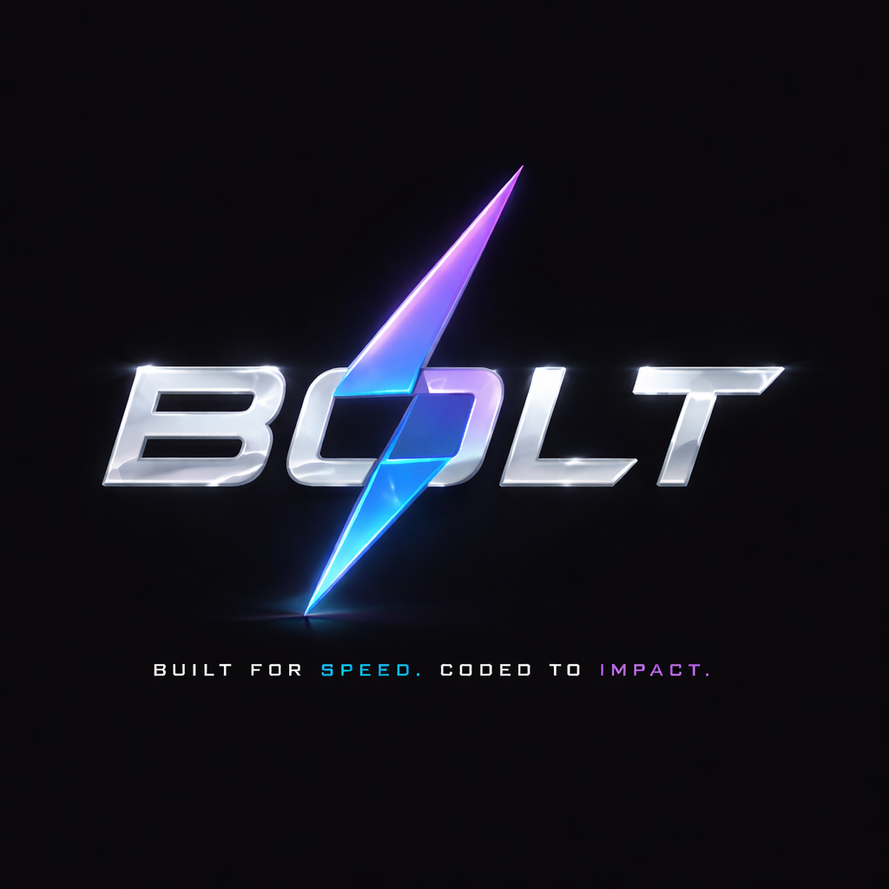
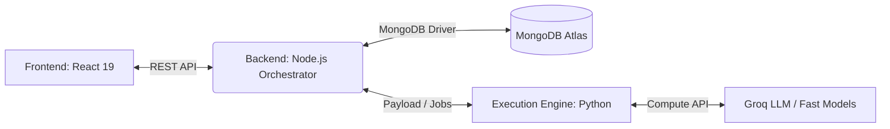
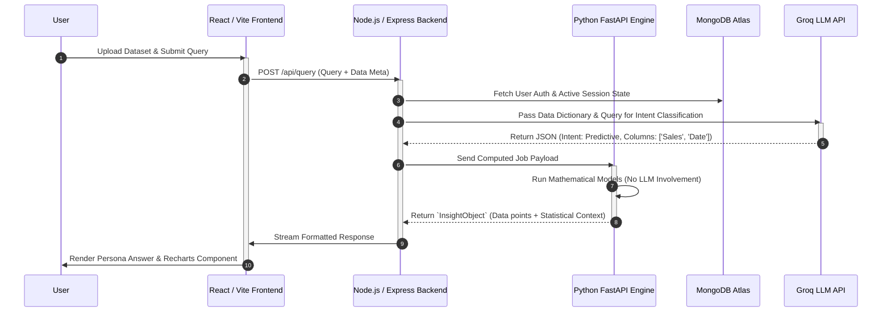

<div align="center">
  

  # Bolt - Speed & Impact

  **Your AI-powered data analyst. Talk to your data in plain language, eliminate AI hallucinations, and get instant, rigorous, persona-aware insights.**

  <br />
  <a href="https://bolt-kzf5.onrender.com/">
    
  </a>
  <br />

  [](https://opensource.org/licenses/MIT)
  [](https://reactjs.org/)
  [](https://nodejs.org/)
  [](https://www.python.org/)
  [](https://vitejs.dev/)
</div>

---

## Overview

Bolt is a three-tier analytical platform built for the **NatWest Hackathon 2026** by **Algo-Vengers**.
It combines a fast conversational UI, an LLM-powered orchestration layer, and a deterministic Python execution engine so users can ask plain-language questions about structured datasets and receive answers they can actually trust.

The key design principle is simple:

- Use the LLM for **intent understanding**
- Use Python for **all mathematics and data processing**
- Use React for **clear, persona-aware, accessible presentation**

This separation is what lets Bolt stay conversational **without letting the model invent numbers**.

---

## The Problem and Our Solution

In enterprise banking and finance, **Large Language Models (LLMs) have a catastrophic flaw: they hallucinate mathematics.**
You cannot trust a generic LLM to calculate a portfolio's 6-month forecast, identify a true statistical anomaly with a z-score, or produce an audit-safe business answer just because it sounds confident.

At the same time, traditional BI platforms such as Power BI and Tableau are often too rigid for non-technical users and do not provide truly conversational, multilingual, persona-aware interaction.

**Bolt solves this.**

Bolt introduces a **Deterministic Decoupled Architecture**:

- Groq-powered LLMs are used only to understand the user's intent, classify the task, and compile a structured execution plan.
- The actual computation layer is fully isolated in a Python FastAPI engine running deterministic analytics with `Pandas`, `NumPy`, and supporting statistical logic.
- The UI then renders the result as a persona-aware explanation with dynamic charts, confidence, evidence, and follow-up actions.

The result is a platform that delivers:

- **No hallucinated metrics**
- **Zero math performed by the LLM**
- **Enterprise-grade explainability**
- **Fast conversational analytics for both technical and non-technical users**

---

## Why Bolt Matters

Bolt is not just a chat UI over a CSV.
It is a deliberate trust architecture for enterprise analytics:

- **The LLM handles the "What"**: what is the user asking for?
- **The engine handles the "Math"**: aggregations, z-scores, forecasting, and comparisons are computed deterministically.
- **The frontend handles the "How"**: the same result can be re-rendered for a Beginner, Executive, Analyst, or Compliance persona without re-spending tokens or recomputing the query.

That is the difference between a flashy prototype and a trustworthy analytical platform.

---

## Comprehensive Feature Set

### 1. Zero-Hallucination Mathematical Engine

- **Deterministic Python Execution:** Natural language queries are converted into structured execution plans and computed only inside the Python engine.
- **Dynamic Schema Profiling:** Uploaded CSVs are profiled to identify likely metric, date, and dimension columns before analytical inference begins.
- **Universal CSV Loader:** Bolt handles multiple encodings including UTF-8, UTF-8-SIG, Latin-1, CP1252, and ISO-8859-1.
- **Robust Date Parsing:** The execution engine supports multiple date formats across 7 common patterns and falls back to inference when needed.
- **Secure Dataset Resolution:** Uploaded and packaged datasets are restricted to safe engine directories.
- **Read-Only Compute Contract:** The orchestration prompt explicitly blocks state-changing behavior and keeps the LLM in a compiler-only role.

### 2. Multi-Tiered Advanced Analytics

- **Descriptive Analysis:** Multi-dimensional aggregations, trend summaries, and category breakdowns.
- **Diagnostic Analysis:** Z-score anomaly detection plus contribution analysis for root-cause discovery.
- **Predictive Analysis:** 6-month multi-period forecasting with MAPE-based confidence signaling.
- **Comparative Analysis:** Period-over-period delta tracking across timeframes or categories.
- **Multi-Intent Handling:** A single query can trigger multiple analytical modes at once.

### 3. State-of-the-Art Dynamic Visualizations

- **Recharts-Driven Coordinates:** The engine returns structured chart payloads, not just text.
- **Auto-Selecting Chart Typer:** Bolt selects visuals based on query type, persona, and result shape.
- **Rich Chart Support:** Line, Bar, KPI, Table, Pie, Scatter, Sparkline, Bullet, Gauge, Treemap, Stacked Bar, Waterfall, and Diverging Bar.
- **Persona-Aware Visual Selection:** Different personas can see the same insight through different visual defaults.
- **Frontend Safety Fallbacks:** Large or malformed visual payloads gracefully fall back to safer render modes.
- **Instant Re-Rendering:** Users can swap personas without rerunning the analysis.

### 4. Smart Persona Engine

A CEO and a Data Engineer should not get the same answer to the same question.

- **6 Built-in Personas:** *Beginner, Everyday, SME, Executive, Analyst,* and *Compliance*
- **Offline Persona Switching:** Existing results are re-rendered locally without a fresh backend call.
- **Persona-Tuned Explanations:** Headlines, insights, actions, and chart choices change by persona.
- **Behavior-Aware Onboarding:** A short onboarding flow maps user intent and trust preferences into an initial persona.
- **Trust Transition Screen:** The system explicitly positions itself as deterministic and trust-aware before the user enters the workspace.

### 5. Universal Accessibility and Inclusive Design

- **Audio "Blind Mode":** Holding the `Spacebar` for 5 seconds activates self-voicing mode through the Web Speech API.
- **Focused Navigation Reading:** Buttons and focused controls are read aloud.
- **Native Voice Input:** Users can speak their query using speech recognition.
- **Voice Response Playback:** Bolt can read insights aloud automatically.
- **11-Language i18n:** English, Hindi, Bengali, Telugu, Marathi, Tamil, Spanish, French, Mandarin, Arabic, and German.
- **Arabic RTL Support:** The layout flips for right-to-left languages.
- **Language-Aware LLM Output:** Conversational and explanatory layers follow the selected interface language.

### 6. Trust, Session, and Evidence Features

- **Evidence Panel:** Inspect any response to view dataset context, confidence, method, raw values, filters, formulas, and limitations.
- **Confidence States:** Responses are labeled as Verified, Estimated, or Transparent.
- **Conversation Persistence:** Bolt restores conversations from MongoDB and falls back to localStorage when needed.
- **Session Continuity:** Returning users can resume previous conversations and datasets.
- **Fresh Conversation Reset:** Users can start a new thread without losing the overall platform state.
- **Suggested Follow-Up Actions:** Each result includes persona-aware next questions.
- **Explain This for Me:** Users can ask Bolt to simplify or reinterpret a response block in context.

### 7. Built for Real Enterprise Usage

- **Warm-Up Awareness:** The app includes a service warm-up screen for platforms like Render.
- **Enterprise Demo Path:** A packaged `Superstore.csv` dataset lets evaluators test the platform instantly.
- **Custom CSV Path:** Users can upload their own CSV and immediately receive schema detection and dataset-aware prompts.
- **Privacy by Design:** Raw values stay inside the deterministic data pipeline; only schema and query context are exposed to the LLM compiler layer.

---

## Detailed Walkthrough of the Webpage

If you open the live demo or local app, this is the experience from first screen to final insight.

### 1. Warm-Up / Boot Screen

The first screen is a service readiness screen.
Because Bolt runs as multiple services, the backend and Python engine can wake up at different times on hosted platforms.

What the user sees:

- A startup progress bar
- Separate readiness cards for the **Backend** and **Execution Engine**
- A retry option if one of the services is still cold-starting

Why it matters:

- It makes deployment latency explicit instead of looking like the product is broken.
- It improves trust during demos on Render or other hosted environments.

### 2. Login Screen

Once the services are ready, the user lands on a login screen with the Bolt brand and a language selector.

What the user does:

- Enters a user ID
- Selects a preferred language from the top-right switcher

What happens behind the scenes:

- Bolt creates or restores the user's profile
- Returning users can reconnect to earlier conversations and persona state

### 3. Data Connection / Upload Screen

After login, the user reaches the data entry step.
This is one of the most important screens because it defines how the system understands the dataset.

The page offers **two paths**:

#### Option A: General User Mode

This path is for uploading a real CSV.

The experience includes:

- Drag-and-drop CSV upload
- File picker fallback
- Upload progress state
- Schema profiling state
- Auto-detected preview of:
  - likely metric column
  - likely date column
  - key dimension columns
  - date range when available

This is where Bolt proves it is not blindly chatting about data.
Before analysis begins, it first understands the structure of the dataset.

#### Option B: Enterprise / Business User Mode

This path uses the bundled `execution_engine/data/Superstore.csv` dataset.

Why this is useful:

- Judges and demo users can enter the platform instantly
- It guarantees there is a known, analytics-friendly dataset ready for testing

### 4. Persona Onboarding Screen

If the user is new, Bolt launches a short multi-step onboarding questionnaire.
This is not cosmetic.
It helps the system decide how outputs should be framed.

Questions focus on:

- Who the user is answering to
- What kind of trust signal they need
- Whether they instinctively want action, explanation, or verification
- What visual style they prefer

What happens next:

- Bolt maps the responses to one of the six personas
- If the backend is available, that persona is stored for future sessions
- If not, Bolt can still fall back to a local persona decision path

### 5. Trust Transition Screen

Before the user enters the workspace, Bolt shows a short transition screen.
This reinforces that the system is configuring itself for the chosen persona and that outputs are deterministic and trust-aware.

### 6. Main Analysis Workspace

The main page is a **three-panel layout** designed for continuous analysis.

#### Left Panel: Control Rail

This panel contains:

- query input
- voice recording button
- analyze button
- active dataset reference
- current persona switcher
- language switcher
- voice mode toggle
- logout button
- start fresh button
- dynamic suggested prompts based on the active persona and schema

#### Middle Panel: Conversation and Insights

This is the core chat surface where user questions and Bolt responses appear.

What appears here:

- User messages
- AI response cards
- Headline summary
- Primary chart
- Secondary chart when useful
- KPI strips
- Narrative insight blocks
- Diagnostic anomaly indicators
- Recommended next-step follow-up questions

#### Right Panel: Evidence Panel

This is where Bolt differentiates itself from a generic chatbot.
When a user clicks **Open Details** on a response, the right panel shows:

- dataset reference
- detected schema
- original query
- persona label
- suggested visual
- query types
- confidence score
- source label
- timestamp
- notes
- active filters
- formula or delta logic when available
- raw values
- limitations

### 7. Response Card Behavior

Each AI response card is designed to be interactive and layered.
Within a single result, the user can:

- read a persona-aware headline
- inspect confidence
- listen to the response aloud
- open evidence details
- ask Bolt to explain a block in simpler terms
- click recommended follow-up actions to continue the analysis

### 8. Accessibility and Multilingual Experience in the UI

The webpage is intentionally designed to be inclusive:

- Blind Mode can be activated with a long `Spacebar` hold
- Focused controls are read aloud
- AI responses can be spoken
- Voice input enables hands-free querying
- The interface text and response generation both adapt to the selected language
- Arabic triggers full RTL layout behavior

---

## Architecture and System Workflow

Bolt isolates rapid user experience from deep computational logic.
The architecture is intentionally decoupled so that UI responsiveness, orchestration logic, and deterministic analytics remain independent and scalable.

### Core Infrastructure Diagram



| Sub-System | Domain / Port | Tech Stack | Responsibility |
|-------|------|-------|---------|
| **Frontend UI** | Port `5173` | React 19, Vite, Tailwind, Recharts, i18n | Presentation shell, persona switcher, chart renderer, voice I/O, evidence panel |
| **Backend API** | Port `5000` | Node.js, Express, Mongoose, Groq SDK | Auth, session state, LLM intent routing, file proxying, engine orchestration |
| **Execution Engine** | Port `8000` | Python 3, FastAPI, Pandas, NumPy, scikit-learn | Data profiling, deterministic analytics, forecasting, anomaly mapping |

### Data Validation Sequence



## How the Query Pipeline Works

From the user's point of view, Bolt feels like a conversational product.
Under the hood, the pipeline is deliberately strict:

1. The user submits a question in natural language.
2. The frontend classifies the likely intent for UX purposes and sends the query to the backend.
3. The backend asks Groq to generate a **strict JSON execution plan**, not an answer.
4. The plan is forwarded to the Python engine.
5. The Python engine runs the actual aggregation, comparison, anomaly detection, or forecast.
6. The engine returns a structured result contract with metrics, diagnostics, predictions, and chart payloads.
7. The frontend adapts that contract into persona-aware cards, charts, confidence states, and evidence.
8. If the user switches persona, the existing response is re-rendered locally without recomputing the analysis.

That architecture is the heart of Bolt's "trust over theatrics" philosophy.

---

## Physical Project Structure

```text
Natwest-Hackathon/
|-- backend/                # Node.js orchestration layer
|   |-- src/
|   |   |-- controllers/    # API request handlers
|   |   |-- models/         # MongoDB schemas (User, Conversation)
|   |   |-- routes/         # Express endpoints
|   |   |-- services/       # Groq interface and job dispatcher
|   |   |-- utils/          # DB and execution engine clients
|   |   `-- server.js       # App entry
|-- execution_engine/       # Python mathematical execution layer
|   |-- data/               # Packaged demo datasets
|   |-- uploads/            # Uploaded CSV storage
|   `-- src/
|       |-- api/            # FastAPI routes and profiler endpoints
|       |-- core/           # Model router and response schema
|       |-- models/         # Descriptive, diagnostic, predictive, comparative logic
|       `-- main.py         # Uvicorn app setup
|-- frontend/               # React 19 presentation layer
|   `-- src/
|       |-- components/     # Login, upload, onboarding, presentation shell, response cards
|       |-- hooks/          # useBlindMode
|       |-- locales/        # 11-language translation JSONs
|       |-- services/       # API adapters, session, persistence, feedback
|       |-- stores/         # App state and session restoration
|       |-- utils/          # Response mapping and adaptation logic
|       |-- i18n.ts         # i18next configuration
|       `-- main.tsx        # React root
`-- scripts/
    `-- start_all.bat       # One-click Windows launcher
```

---

## Quick Start and Local Setup

We've made booting a 3-tier enterprise platform locally as easy as possible.

> **LIVE DEMO:** Skip local setup and try the deployed app here: [https://bolt-kzf5.onrender.com/](https://bolt-kzf5.onrender.com/)

### Prerequisites

- **Node.js** `18+` for local development, with Render pinned to `20.x`
- **Python** `3.10+`
- **MongoDB** cluster (Atlas or local)
- **Groq API Key** from [console.groq.com](https://console.groq.com)

### Installation

Clone the repository and configure the environment files:

```bash
git clone https://github.com/Harshitaaaaaaaaaa/Natwest-Hackathon
cd Natwest-Hackathon
```

### Environment Configuration

**Backend Configuration** (`backend/.env`):

```env
MONGODB_URI=mongodb+srv://<user>:<password>@cluster.mongodb.net/
GROQ_API_KEY=gsk_your_key_here
PORT=5000
EXECUTION_ENGINE_URL=http://localhost:8000
CORS_ALLOWED_ORIGINS=http://localhost:5173
```

**Frontend Configuration** (`frontend/.env`):

```env
VITE_GROQ_API_KEY=gsk_your_key_here
VITE_CHAT_API_URL=http://localhost:5000
```

### Dependency Installation

Run the following commands from the project root:

```bash
cd frontend && npm install
cd ../backend && npm install
cd ../execution_engine && pip install -r requirements.txt
```

### Execution

**For Windows (One-Click Boot):**

```cmd
scripts\start_all.bat
```

**For Mac/Linux (Multi-terminal Boot):**

```bash
# Terminal 1: Boot Python deterministic math engine
cd execution_engine && python -m uvicorn src.main:app --port 8000 --host 0.0.0.0

# Terminal 2: Boot Node API
cd backend && npm run dev

# Terminal 3: Boot React UI
cd frontend && npm run dev
```

Navigate to [http://localhost:5173](http://localhost:5173) to enter the platform.

> **Note on Testing Data:** Sample datasets are included in `execution_engine/data/` such as `Superstore.csv`. For the best first-run demo experience, upload or select that file to explore the full analytical feature set.

---

## Deployment Notes

### Frontend

- Build with `cd frontend && npm run build`
- Static output is generated in `frontend/dist/`
- Can be hosted on Render Static Sites, Netlify, Vercel, or any static host

### Backend

- Start with `npm start`
- Requires `MONGODB_URI`, `GROQ_API_KEY`, and `EXECUTION_ENGINE_URL`
- Exposes health routes at `/` and `/health/ready`

### Execution Engine

- Native start:

```bash
cd execution_engine && python -m uvicorn src.main:app --host 0.0.0.0 --port ${PORT:-8000}
```

- It exposes deterministic compute and dataset profiling routes such as:
  - `/compute`
  - `/health`
  - `/upload_dataset`
  - `/analyze_schema`

### Render Deployment

The repo includes a root-level `render.yaml` blueprint that provisions:

- `Bolt-frontend` (Static Site)
- `Bolt-backend` (Node Web Service)
- `Bolt-engine` (Python Web Service)

Environment wiring handled in Render:

- `VITE_CHAT_API_URL` -> backend URL
- `EXECUTION_ENGINE_URL` -> engine URL
- `CORS_ALLOWED_ORIGINS` -> frontend URL

Required secret environment variables:

- Backend: `MONGODB_URI`, `GROQ_API_KEY`
- Frontend: `VITE_GROQ_API_KEY` if frontend-side Groq features are enabled

Important deployment note:

- Uploads are proxied backend -> engine so the file is saved in the engine service where the computation actually runs.

---

## Challenges We Faced and How We Solved Them

Hackathon products often look smooth only on the surface.
Bolt required solving real engineering issues across deployment, orchestration, analytics, and UI reliability.

### 1. LLM Rate Limits and Response Stability

**Challenge:** Fast LLM demos can break under API limits, especially during repeated testing and live judging.

**What we faced:**

- Provider-side `429` rate limits
- failed key exhaustion
- inconsistent response reliability under repeated query traffic

**How we solved it:**

- implemented multi-key Groq rotation on both frontend and backend
- used low-temperature JSON-mode prompting for deterministic execution-plan generation
- separated "LLM for intent" from "Python for math" so partial LLM instability would not corrupt the numeric layer
- added fallback keyword classification when the LLM is unavailable

### 2. Render Cold Starts and Hosted Demo Reliability

**Challenge:** Multi-service deployments on Render can appear broken during cold starts, especially when backend and engine wake up asynchronously.

**What we faced:**

- backend and engine waking at different times
- health checks passing for one service while another was still sleeping
- poor first impressions during hosted demos

**How we solved it:**

- added a dedicated warm-up screen in the frontend
- built backend readiness checks that wait for the execution engine to be ready
- added retry flows and visible progress to make deployment latency understandable to users
- exposed explicit `/health` and `/health/ready` paths

### 3. File Upload and Dataset Profiling

**Challenge:** Real CSVs are messy. They arrive with dirty encodings, inconsistent date formats, and unpredictable column structures.

**What we faced:**

- encoding mismatches
- ambiguous date columns
- unsafe filenames
- upload handling across separate backend and engine services

**How we solved it:**

- proxied uploads through the backend into the execution engine
- used in-memory upload handling with `multer`
- sanitized filenames and generated unique dataset refs
- added schema profiling before the first query
- supported multiple encodings and broad date parsing in the engine
- restricted dataset resolution to safe `data/` and `uploads/` zones

### 4. Engine API Reliability and Cross-Service Communication

**Challenge:** A three-service app becomes fragile if the API contracts between frontend, backend, and engine are inconsistent.

**What we faced:**

- retries needed for network timeouts and waking services
- schema/profile endpoints needing to behave differently from compute routes
- the need to pass enough schema context to the orchestrator without exposing raw data to the LLM

**How we solved it:**

- built a shared engine client with retry and timeout logic
- standardized backend proxy routes for upload, schema profiling, and compute
- used a strict execution-plan contract between Node and Python
- passed only dataset metadata and schema context to the LLM compiler

### 5. Frontend Rendering Under Unpredictable Analytical Output

**Challenge:** Analytical payloads vary wildly depending on the query, persona, and dataset shape.

**What we faced:**

- charts with too many categories
- malformed or incomplete points
- visuals that became unreadable on certain payloads
- different personas needing different visual defaults from the same data

**How we solved it:**

- added visual fallback rules for pie, bar, and scatter edge cases
- filtered NaN and Infinity values before rendering
- bounded category outputs and added "Others" style bucketing in the engine utilities
- separated raw result contracts from persona-aware rendering so the same output can be reshaped cleanly

### 6. Persona Switching Without Requerying

**Challenge:** We wanted the same computed answer to feel appropriate for six different users without paying for six LLM calls or rerunning analytics.

**What we faced:**

- separate narrative styles and chart preferences per persona
- preserving trust while changing tone
- avoiding duplicate backend calls

**How we solved it:**

- stored the raw deterministic insight contract on the client
- created a response mapper that rebuilds the UI response locally for each persona
- made persona switching instant and token-free

### 7. Accessibility, Voice, and Multilingual UX

**Challenge:** Accessibility features often conflict with visually dense analytics interfaces.

**What we faced:**

- making charts and controls usable for visually impaired users
- supporting speech input and speech output
- keeping layouts stable in RTL languages like Arabic

**How we solved it:**

- created Blind Mode with keyboard activation and speech synthesis
- enabled voice input through browser speech recognition
- tied UI translation and LLM language generation to the same language state
- supported RTL layout direction switching in the interface

### 8. Persistence and Resilience

**Challenge:** Hackathon apps often lose all context on refresh or fail completely when the backend is down.

**What we faced:**

- conversation restoration
- partial backend availability
- user continuity between sessions

**How we solved it:**

- persisted state to MongoDB
- added localStorage fallbacks for conversation continuity
- restored cached messages while backend history loads
- preserved user, persona, dataset, and conversation state across sessions

---

## Scope for Improvement and Future Roadmap

Bolt already proves the core trust architecture, but there is clear room to take it further.

### 1. Stronger Enterprise Data Connectivity

- direct connectors for SQL, Snowflake, Databricks, S3, and internal banking warehouses
- scheduled refresh pipelines instead of upload-only data ingestion
- governed dataset catalogs and metadata lineage

### 2. More Advanced Forecasting and Statistical Depth

- richer forecasting beyond rolling 6-month projections
- seasonality-aware and model-selection-aware prediction pipelines
- deeper statistical testing and confidence interval visualization
- benchmark comparisons and scenario simulation

### 3. Governance, Security, and Audit

- SSO and role-based access control
- dataset-level permissions
- downloadable audit logs
- policy-aware explanation templates for regulated use cases

### 4. Better UX for Large-Scale Usage

- streaming responses instead of only final payload delivery
- background jobs for very large files
- multi-dataset comparison in a single session
- exportable reports and slide-ready executive summaries

### 5. Broader Accessibility and Mobile Optimization

- richer chart sonification
- keyboard-first workflows across every control
- stronger mobile responsiveness for executive tablet usage
- accessibility testing across more browsers and assistive technologies

### 6. Engineering Quality and Observability

- fuller automated test coverage across frontend, backend, and engine
- distributed tracing between services
- analytics on query success, failure, and latency
- stronger contract tests for frontend-to-backend-to-engine payloads

---

## Business Impact for NatWest

Bolt is not just a technical prototype; it addresses real enterprise pain points:

1. **Immediate Productivity:** Reduces time-to-insight from hours of analyst preparation to seconds of conversational interaction.
2. **Defensible Accuracy:** Keeps all mathematics inside a deterministic execution layer so important business reporting is not distorted by LLM hallucinations.
3. **Inclusive Analytics:** Adapts to the user, whether they are visually impaired, working in Arabic, non-technical, or deeply analytical.
4. **Better Decision Surfaces:** Gives executives concise answers, analysts detailed evidence, and compliance teams auditable outputs from the same underlying truth.

---

## License

Internal use - NatWest Hackathon 2026.

---

<div align="center">
  <i>Bolt by Algo-Vengers for the NatWest Hackathon 2026</i>
</div>
